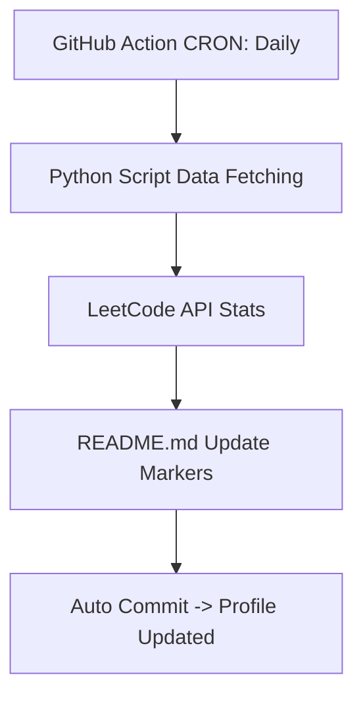

<h1 align="center">Hi 👋, I'm Adithya Yanamalamanda</h1>
<h3 align="center">🚀 AI Developer | Full Stack Engineer</h3>

---

## 🧠 About Me

- 🔭 Building AI-powered real-world systems  
- 📰 Working on News Intelligence Platforms  
- 🌱 Learning Deep Learning & System Design  

---

## 🌐 Profiles

- 💻 GitHub: https://github.com/adithyayanamalamanda  
- 💼 LinkedIn: https://www.linkedin.com/in/yanamalamanda-adithya/  
- 🌍 Portfolio: https://adithyayanamalamanda.github.io/mine  

---

## 📊 GitHub Stats (Auto)

  
  

  

---

## 🧠 LeetCode Dashboard (Live)

<!-- LEETCODE_START -->

### 🧠 LeetCode Progress (Live)

| 🔥 Total Solved | 🟢 Easy | 🟡 Medium | 🔴 Hard |
| :---: | :---: | :---: | :---: |
| **250** | **120** | **100** | **30** |

  <b>Ranking:</b> <code>123,456</code> | <b>Acceptance Rate:</b> <code>58.2%</code>

<!-- LEETCODE_END -->

  Last updated automatically via GitHub Actions.

---

## 🚀 Dynamic GitHub Profile README System

Designed and implemented a fully automated system that dynamically reflects real-time activity and performance across coding platforms.

### 🎯 Objective
Automatically update coding statistics and problem-solving metrics on a daily schedule without manual intervention.

### 🧱 System Architecture

### 🧠 Core Features
- **Real-time Stats**: Fetches problem-solving metrics directly from LeetCode.
- **Fully Automated**: Runs daily via GitHub Actions.
- **Safe Updates**: Uses a custom injection system with markers to prevent overwriting other content.

---

---

## ⚡ Daily Motivation

  

---
